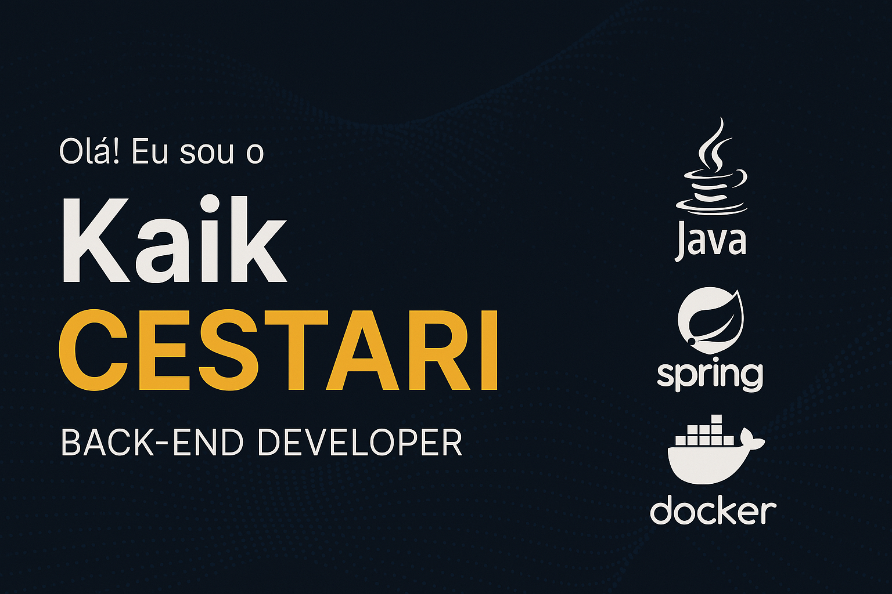

<!-- Banner -->

👋 Olá, eu sou **Kaik Cestari**!  
🎯 Desenvolvedor **Backend Java** focado em criar soluções escaláveis, com qualidade de código e boas práticas de arquitetura.  
🚀 Atualmente, meu foco está em **Java e Spring Boot**, mas já estudei tecnologias que me dão visão fullstack e fortalecem meu trabalho no backend.  

---

## 🔧 Tech Stack  

  

  

  

---

## 📫 Contato  
✉️ Email: **kaikcestaridev@gmail.com**  
🔗 LinkedIn: [linkedin.com/in/kaikcestari](https://linkedin.com/in/kaikcestari)  

